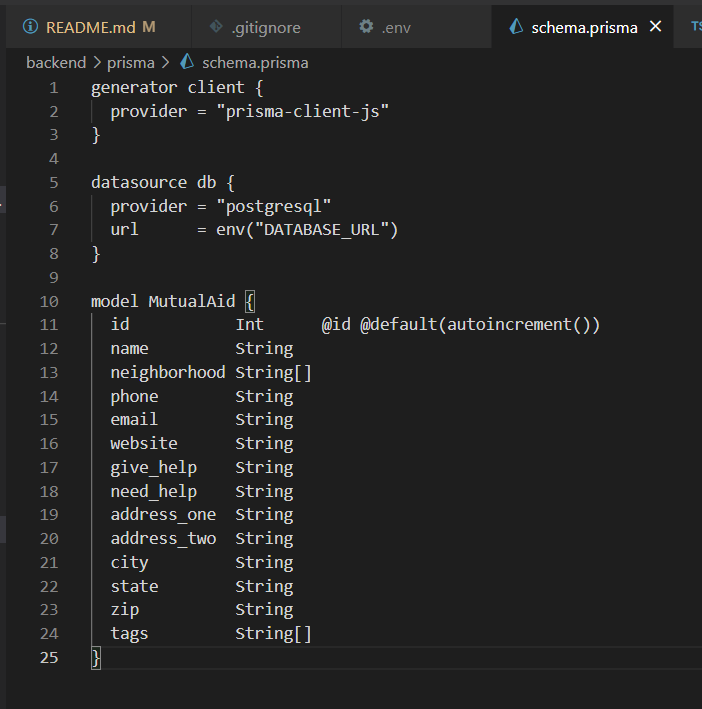
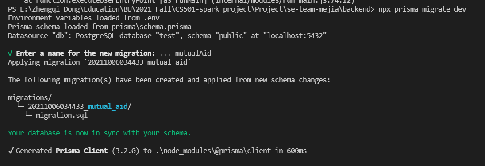
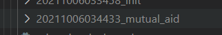
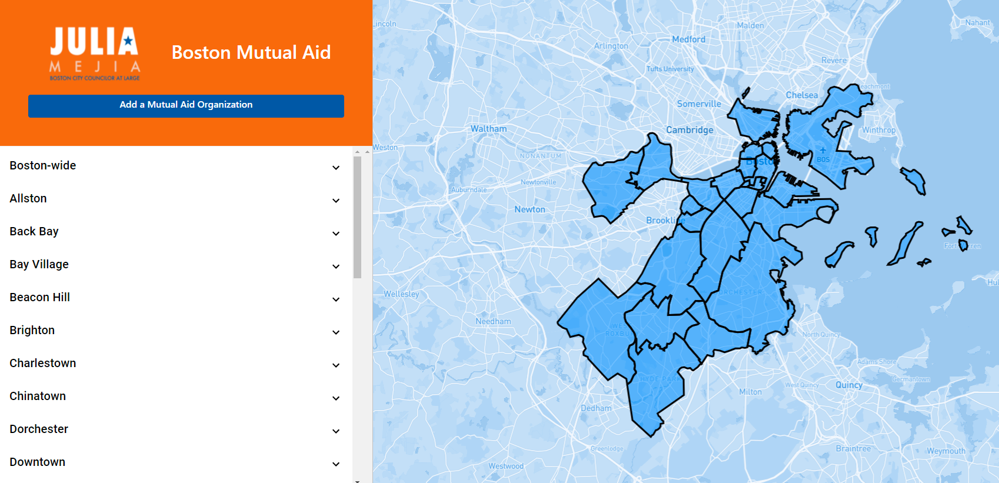

# Boston Mutual Aid Site

## Team Mejia Development Team

* Aira Cosino
* Jared Min
* Jeffrey Jin
* Johanne Antoine
* Suhail Singh

## Build Some Understanding:

- Why use Prisma:
  - Database: work with MySQL, PostgreSQL, SQLite, Microsoft SQL Server 
  - Work inside with any JavaScript or TypeScript environment.

- What is Prisma Studio: 

It's a libraryan admin UI to view and edit the data inside your database


## Technologies Used  
For the backend we used Prisma as our ORM, Express.js for the backend server, and React for the frontend.

## Requirements
### Frontend
For dev on the frontend you'll need to install:
- React (instructions to install can be found [here](https://reactjs.org/docs/create-a-new-react-app.html))

### Backend
For dev on the backend you'll need to install: 
- Express (instructions to install can be found [here](https://expressjs.com/en/starter/installing.html))
- Prisma (instructions to install can be found [here](https://www.prisma.io/docs/getting-started/quickstart-typescript))

## Quickstart

### Frontend
1. Go into frontend folder
```bash
$ cd frontend
```
2. Install the node packages
```bash
$ npm install
```
3. Create a file called .env.development inside the frontend folder. Add your MapBox Access Token (You can create a Mapbox account [here](https://account.mapbox.com))) as a variable named GATSBY_MAPBOX_ACCESS_TOKEN to the. Then run: 
```bash
$ npm run develop
```
The site should be running on [http://0.0.0.0:8000](http://0.0.0.0:8000)\
Make sure to have backend running before running the frontend.

### Backend

1. Go into backend folder
```bash
$ cd backend
```
2. Create a .env file in the backend folder and add your database url as a environment variable called DATABASE_URL (Please contact the dev team if you would like to use the original database url).
3. Set up the database for prisma and import the mutual aid data (not necessary if using original database).
```bash
# [Option] 
$ npx prisma migrate dev --name init	# If this is your first time, you need tor un this to create the tables in your database according to the prisma schema. 

# [Option]
$ npx prisma db pull    # This will pull the schema from your database(e.g., PostgreSQL) and synchronize to your application(e.g., schema.prisma)

# [Option]
$ npx prisma migrate dev    # This will push the schema from your application(e.g., schema.prisma) to your database(e.g., PostgreSQL)

# [Option] 
$ npx prisma generate	# This will generate the correct data source client code (e.g. Prisma Client), or models that represent tables in the SQLite database, which has been defined in scripts.ts, read more here https://www.prisma.io/docs/concepts/components/prisma-schema#naming

$ npx ts-node ./src/scripts.ts
```

Note: If you have problem running npx prisma introspect , it’s probably because you have an empty database with no table created. In this case, run npx prisma migrate dev --name init instead; this will create the tables in your database according to the prisma schema. 

```bash
$ npx prisma migrate dev --name init
```

4. Start the server
```bash
$ npm install
$ npm start
```
The server should be running on [http://0.0.0.0:5000](http://0.0.0.0:5000)


## Debug/Troubleshotting

### Problem 1: 


==> It’s saying that it cannot find the module that you are using.

==> In this case it’s a typo, notice it should be  `ts-code`, instead of `t-code`

### Problem 2:


==> In line 35, we are asking it to create a table named mutualAid , but it has problem in finding its definition in the database.

Here is what you wanna to troubleshoot:

==> First, check your database management, see if a table called “MutualAid” has created or not?

If it does, you should see something similar to the picture below:


Otherwise, you might want to check scheme.prisma file, and see if you have a Object model that called MutualAid that is defined there. If not, ceated it as shown below:



And then run the following command:

```bash
$ npx prisma migrate dev  # ==> This will synchronize the database with your schema defined in schema.prisma file
```



This verifies the creation:



And then type:

```bash
$ npx prisma generate	# This will generate the correct data source client code (e.g. Prisma Client), or models that represent tables in the SQLite database, which has been defined in scripts.ts, read more here https://www.prisma.io/docs/concepts/components/prisma-schema#naming
```


Then you can start to generate object records(dfiend in your index.ts file) into database:

```bash
$ npx ts-node ./src/scripts.ts
# Read more here, https://www.prisma.io/docs/getting-started/setup-prisma/start-from-scratch/mongodb/querying-the-database-typescript-mongodb#write-your-first-query-with-prisma-client
```

After all the data record had been populated, you can start running the backend with `npm start`, and then frontend. And you should see something like this at the end:




– If you still confuse, read more details here [Prisma Migrate](https://www.prisma.io/docs/concepts/components/prisma-migrate), [Prisma schema](https://www.prisma.io/docs/concepts/components/prisma-schema#naming), [Querying the database](https://www.prisma.io/docs/getting-started/setup-prisma/start-from-scratch/mongodb/querying-the-database-typescript-mongodb#write-your-first-query-with-prisma-client)


## Reference:
- What is your "DATABASE_URL"? ==> [Database connectors PostgreSQL](https://www.prisma.io/docs/concepts/database-connectors/postgresql)
- Getting start with Prisma? ==> https://www.prisma.io/docs/concepts/overview/what-is-prisma

  